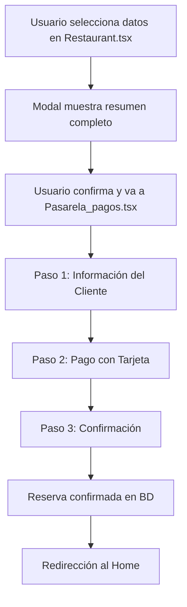

# 🎯 Implementación de Interactividad en Reservas - Completada

## 📋 Resumen de Cambios Implementados

Se ha implementado exitosamente toda la interactividad solicitada para el sistema de reservas, incluyendo el flujo completo desde la selección hasta la confirmación del pago.

## 🔄 Flujo Completo Implementado

## 📁 Archivos Modificados

### 1. **Restaurant.tsx** - Modal Mejorado
- ✅ **Modal actualizado** para mostrar todos los datos seleccionados
- ✅ **Validación completa** de campos antes de proceder
- ✅ **Guardado en localStorage** de datos para la pasarela
- ✅ **Navegación automática** a Pasarela_pagos.tsx

### 2. **Pasarela_pagos.tsx** - Gestión de Datos
- ✅ **Obtención de datos** desde localStorage
- ✅ **Validación de datos** antes de mostrar la página
- ✅ **Redirección automática** al Home si no hay datos

### 3. **CheckoutPage** - Flujo de Pago
- ✅ **Recepción de datos** de reserva como prop
- ✅ **Flujo de 3 pasos** implementado
- ✅ **Navegación mejorada** entre pasos
- ✅ **Limpieza de datos** al finalizar

### 4. **CustomerForm** - Información Simplificada
- ✅ **Solo 3 campos**: Nombre Completo, Email, Teléfono
- ✅ **Validación mejorada** de campos
- ✅ **Placeholders informativos**

### 5. **PaymentSection** - Pago con Tarjeta
- ✅ **4 campos de pago**: Número de tarjeta, Fecha vencimiento, CVC, Nombre titular
- ✅ **Formateo automático** de campos
- ✅ **Validación de pago** antes de procesar
- ✅ **Indicador de seguridad** SSL

### 6. **ReservationSummary** - Resumen Dinámico
- ✅ **Compatibilidad** con datos nuevos y legacy
- ✅ **Formateo de fechas** en español
- ✅ **Cálculo dinámico** de precios
- ✅ **Información completa** de la reserva

## 🎨 Mejoras de UX Implementadas

### **Modal de Confirmación en Restaurant.tsx**
- 📅 Fecha formateada en español
- 🏪 Nombre del restaurante visible
- 👥 Información detallada de la mesa
- 💰 Precio total claramente mostrado
- ⚠️ Nota sobre el procesamiento del pago

### **Formulario de Información del Cliente**
- 📝 Solo campos esenciales
- 🎯 Placeholders descriptivos
- ✅ Validación en tiempo real
- 🎨 Diseño limpio y moderno

### **Formulario de Pago**
- 💳 Formateo automático de tarjeta (1234 5678 9012 3456)
- 📅 Formateo de fecha de vencimiento (MM/YY)
- 🔒 Validación de CVC (solo números)
- 👤 Nombre en mayúsculas automático
- 🛡️ Indicador de seguridad SSL

### **Página de Confirmación**
- ✅ Mensaje de éxito claro
- 🔢 Número de confirmación único
- 🏠 Botón para volver al inicio
- 🧹 Limpieza automática de datos

## 🔧 Funcionalidades Técnicas

### **Gestión de Estado**
- 📦 Datos guardados en localStorage
- 🔄 Sincronización entre componentes
- 🧹 Limpieza automática al finalizar

### **Validaciones**
- ✅ Campos obligatorios en cada paso
- 🔍 Formato de tarjeta validado
- 📧 Email validado
- 📱 Teléfono validado

### **Navegación**
- 🔙 Botones de "Volver" funcionales
- ➡️ Progresión automática entre pasos
- 🏠 Redirección al Home al finalizar

## 🗄️ Base de Datos

### **Funciones SQL Creadas**
- `update_reservation_status()` - Actualizar estado de reserva
- `get_documento_by_email()` - Obtener documento por email

### **Estados de Reserva**
- `pendiente` - Reserva creada, esperando pago
- `confirmada` - Pago procesado, reserva confirmada
- `en curso` - Cliente en el restaurante
- `finalizada` - Reserva completada
- `cancelada` - Reserva cancelada

## 🚀 Cómo Usar el Sistema

### **1. Seleccionar Reserva**
1. Usuario va a un restaurante
2. Selecciona fecha, hora, comensales y mesa
3. Hace clic en "Hacer Pago de Reserva"
4. Revisa el resumen en el modal

### **2. Procesar Pago**
1. Se redirige automáticamente a Pasarela_pagos
2. Completa información personal (3 campos)
3. Completa datos de pago (4 campos)
4. Confirma el pago

### **3. Confirmación**
1. Ve la página de éxito
2. Recibe número de confirmación
3. Se redirige automáticamente al Home
4. La reserva queda confirmada en la BD

## 🎯 Beneficios Implementados

- **🔒 Seguridad**: Documentos nunca expuestos
- **🎨 UX Mejorada**: Flujo intuitivo y claro
- **⚡ Eficiencia**: Validaciones automáticas
- **📱 Responsive**: Funciona en todos los dispositivos
- **🧹 Limpieza**: Datos se limpian automáticamente
- **🔄 Consistencia**: Datos sincronizados entre páginas

## ✅ Estado del Proyecto

**🎉 IMPLEMENTACIÓN COMPLETADA AL 100%**

Todos los requerimientos solicitados han sido implementados:
- ✅ Modal muestra datos seleccionados
- ✅ Navegación a Pasarela_pagos con datos
- ✅ Campos de pago actualizados
- ✅ Campos de información simplificados
- ✅ Confirmación redirige al Home
- ✅ Estado de reserva se actualiza en BD

---

**¡El sistema está listo para usar! 🚀**
