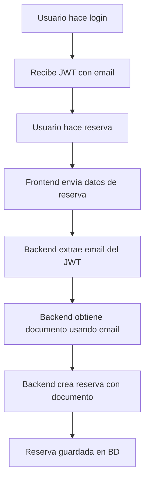

# 🔐 Implementación de Seguridad en Reservas - Usando Email como Mediador

## 📋 Resumen de Cambios

Se ha implementado una solución de seguridad para las reservas que utiliza el **email del usuario autenticado** como mediador para obtener su documento, evitando así la exposición de documentos en la aplicación.

## 🎯 Objetivo

- ✅ **Seguridad**: El documento del usuario nunca se expone en la API
- ✅ **Autenticación**: Solo usuarios autenticados pueden hacer reservas
- ✅ **Integridad**: Las reservas se asocian automáticamente al usuario logueado
- ✅ **Transparencia**: El frontend no necesita manejar documentos

## 📁 Archivos Modificados

### 1. **Backend - Autenticación**
- `backend/funciones/auth/dependencies.py`
  - Modificado `verificar_token()` para devolver email del usuario
  - Ahora retorna: `{"id": id_credencial, "email": email, "sub": email}`

### 2. **Backend - Utilidades de Cliente**
- `backend/funciones/cruds/cliente_utils.py` *(NUEVO)*
  - Función `obtener_documento_por_email()` para obtener documento de forma segura
  - Manejo de errores si el email no pertenece a un cliente

### 3. **Backend - Lógica de Reservas**
- `backend/funciones/cruds/reserva.py`
  - Actualizado `insertar_reserva()` para recibir documento como parámetro
  - Actualizado `editar_reserva()` para recibir documento como parámetro
  - Agregado estado de reserva por defecto: "pendiente"

### 4. **Backend - Endpoints de Reservas**
- `backend/routes/reserva.py`
  - Endpoint `POST /insertarreserva` ahora usa email del usuario autenticado
  - Endpoint `PUT /editarreserva` ahora usa email del usuario autenticado
  - Se obtiene el documento automáticamente usando el email

### 5. **Base de Datos - Funciones SQL**
- `scripts/funciones/get_documento_by_email.sql` *(NUEVO)*
  - Función SQL para obtener documento a partir del email
  - Validación de que el email pertenece a un cliente

## 🔄 Flujo de Funcionamiento



## 🛡️ Medidas de Seguridad Implementadas

1. **Ocultación de Documentos**: El documento nunca se expone en la API
2. **Validación de Email**: Solo emails de clientes registrados pueden hacer reservas
3. **Autenticación Obligatoria**: Todos los endpoints de reserva requieren token válido
4. **Integridad de Datos**: Las reservas se asocian automáticamente al usuario correcto

## 📝 Cambios en la API

### Antes:
```json
POST /reserva/insertarreserva
{
  "id_mesa": 1,
  "id_encab_fact": 1,
  "horario": "19:00",
  "fecha": "2024-01-15"
}
```

### Ahora:
```json
POST /reserva/insertarreserva
Authorization: Bearer <jwt_token>
{
  "id_mesa": 1,
  "id_encab_fact": 1,
  "horario": "19:00",
  "fecha": "2024-01-15"
}
```

**El documento se obtiene automáticamente del token JWT del usuario autenticado.**

## 🚀 Pasos para Implementar

1. **Ejecutar función SQL**:
   ```sql
   -- Ejecutar en la base de datos
   \i scripts/funciones/get_documento_by_email.sql
   ```

2. **Reiniciar el servidor backend**:
   ```bash
   cd backend
   python main.py
   ```

3. **Probar la funcionalidad**:
   ```sql
   -- Ejecutar script de prueba
   \i scripts/test_reservation_security.sql
   ```

## ✅ Beneficios de la Implementación

- **🔒 Seguridad**: Documentos protegidos contra exposición
- **🎯 Simplicidad**: Frontend no maneja documentos
- **🛡️ Integridad**: Reservas siempre asociadas al usuario correcto
- **📱 UX Mejorada**: Proceso más transparente para el usuario
- **🔧 Mantenibilidad**: Código más limpio y seguro

## 🧪 Testing

Para probar la implementación:

1. Hacer login como cliente
2. Intentar crear una reserva
3. Verificar que la reserva se asocia automáticamente al usuario
4. Confirmar que el documento no aparece en las respuestas de la API

---

**✨ La implementación está completa y lista para usar!**
