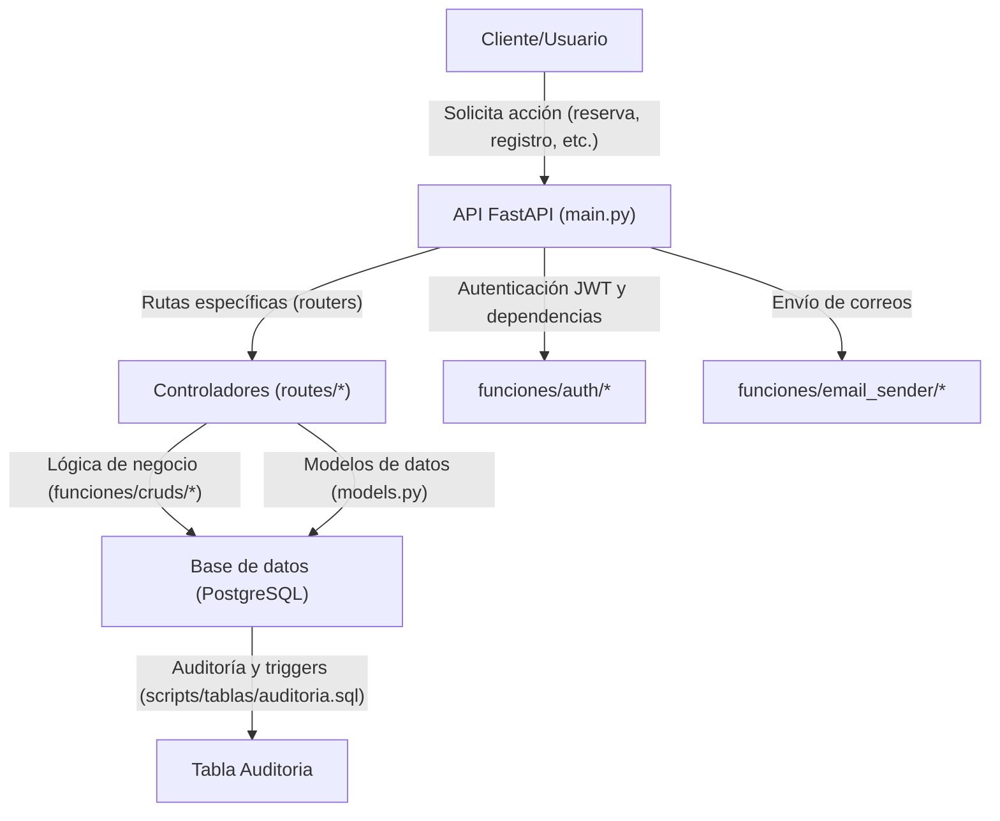

# Resumen del Backend y Scripts de Base de Datos

## Tecnologías Utilizadas

- **Lenguaje principal:** Python 3
- **Framework principal:** FastAPI (API REST)
- **ORM:** SQLAlchemy
- **Autenticación:** JWT (JSON Web Tokens) usando `python-jose`
- **Encriptación de contraseñas:** bcrypt
- **Envío de correos:** Utilidades propias en `funciones/email_sender/`
- **Variables de entorno:** python-dotenv
- **Servidor ASGI:** Uvicorn
- **Base de datos:** PostgreSQL
- **Auditoría y triggers:** PL/pgSQL (PostgreSQL)

## Estructura General del Backend

- `main.py`: Punto de entrada de la API, configuración de CORS, inclusión de routers para cada entidad.
- `routes/`: Define los endpoints para cada recurso (clientes, restaurantes, reservas, etc.).
- `models.py`: Define los modelos de datos (Pydantic) usados para validación y serialización.
- `funciones/cruds/`: Lógica de negocio y acceso a datos (CRUD para cada entidad).
- `funciones/auth/`: Lógica de autenticación, generación y validación de JWT, dependencias de seguridad.
- `funciones/email_sender/`: Utilidades para envío de correos y tareas programadas.
- `config.py`: Configuración de la conexión a la base de datos.

## Funcionamiento General

1. El cliente realiza una petición HTTP a la API (por ejemplo, crear una reserva).
2. FastAPI enruta la petición al controlador correspondiente en `routes/`.
3. El controlador utiliza funciones de `funciones/cruds/` para interactuar con la base de datos.
4. Se usan modelos de `models.py` para validar y estructurar los datos.
5. Si la acción requiere autenticación, se valida el JWT usando las utilidades de `funciones/auth/`.
6. Para ciertas acciones (como reservas), se pueden enviar correos automáticos.
7. Todas las operaciones relevantes quedan registradas en la tabla de auditoría mediante triggers en la base de datos.

## Diagrama de Flujo General

## Scripts de Base de Datos

### 1. Creación de Tablas (`scripts/tablas/creacion_tablas.sql`)
- Define todas las tablas necesarias: Credenciales, Roles, Dueño, Restaurante, Mesas, Cliente, Empleado, Encabezado_Factura, Detalle_Factura, Reserva, Calculos_mensuales, Categorias, Comentarios, jwt_tokens.
- Incluye claves primarias, foráneas y restricciones de integridad (unicidad, checks, etc).
- Elimina tablas existentes en orden inverso para evitar conflictos de dependencias.

### 2. Auditoría (`scripts/tablas/auditoria.sql`)
- Crea la tabla `Auditoria` para registrar todas las operaciones (INSERT, UPDATE, DELETE) sobre las tablas principales.
- Define funciones y triggers en PL/pgSQL para insertar automáticamente registros de auditoría tras cada operación relevante.

### 3. Funciones CRUD (en `scripts/Cruds/`)
- Cada entidad tiene funciones SQL para insertar, editar y borrar registros, por ejemplo:
  - `fun_insertar_categorias.sql`, `fun_editar_categorias.sql`, `fun_borrar_categorias.sql`
  - Estas funciones encapsulan la lógica de manipulación de datos y lanzan excepciones si no se encuentra el registro.

## Resumen de Seguridad y Buenas Prácticas
- Contraseñas encriptadas con bcrypt.
- Autenticación y autorización basada en JWT.
- Validación de datos con Pydantic.
- Auditoría completa de operaciones críticas en la base de datos.
- Uso de variables de entorno para credenciales sensibles.

---

Este archivo resume la arquitectura, funcionamiento y organización del backend y la base de datos del sistema de reservas de restaurantes (Reservify). 